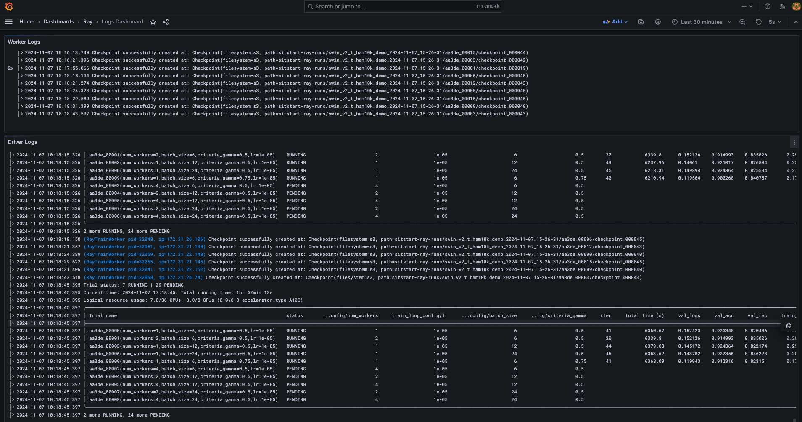
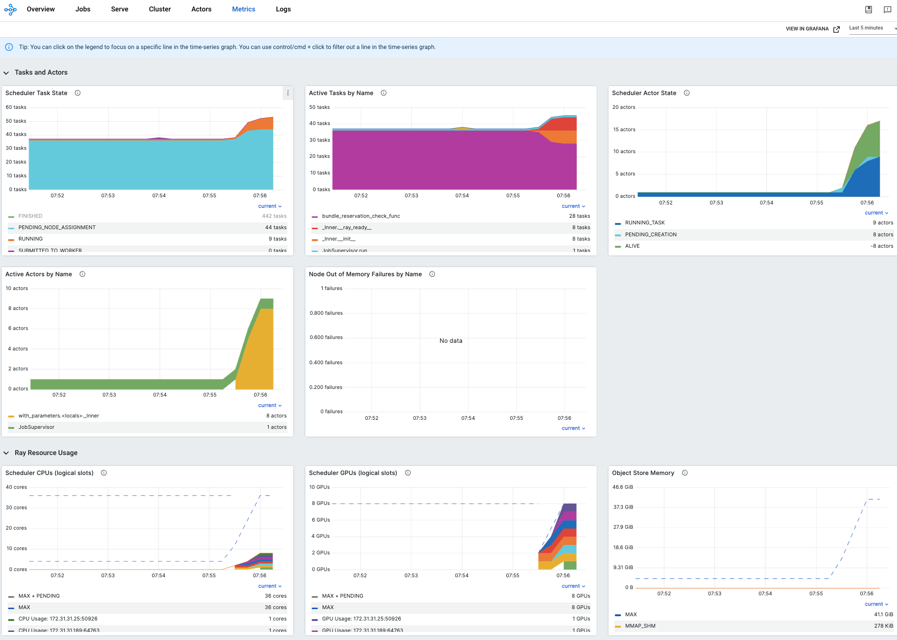
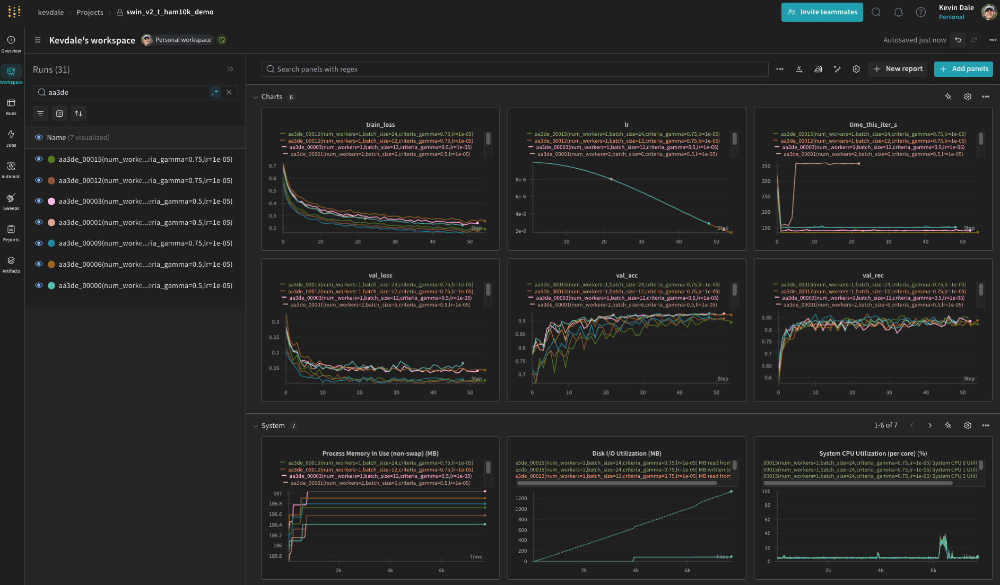
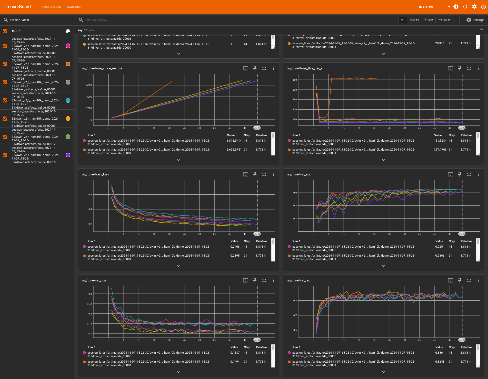

# SitStart <!-- omit in toc -->

## About <!-- omit in toc -->

This codebase implements tools for rapid iteration on ML models, with support for training and hyperparameter tuning with minimal code on auto-scaling GPU clusters. It also features a command-line interface for platform- and project-specific tasks, consistent computing environments across development and training, and highly reproducible experiments.

AWS [EC2](https://aws.amazon.com/ec2) and [S3](https://aws.amazon.com/s3) provide compute and storage, and [Ray Clusters](https://docs.ray.io/en/latest/cluster/getting-started.html), cluster and job management. The training and tuning stack is based on [PyTorch](https://pytorch.org) and builds on the following:

- [Ray Tune](https://docs.ray.io/en/latest/tune/index.html) for experiment execution and hyperparameter tuning
- [PyTorch Lighting](https://lightning.ai/docs/pytorch/stable/) for useful abstractions for data and training modules
- [Hydra](https://hydra.cc/) for powerful and readable application configuration files and experiment definitions
- [Grafana](https://grafana.com) and [Loki](https://grafana.com/go/webinar/getting-started-with-logging-and-grafana-loki) for monitoring cluster metrics and aggregating logs
- [Weights & Biases](https://wandb.ai) for tracking experiment results.

While the systems here were built with multiple users in mind, they have not been extensively tested in multi-user environments, and associated accounts and access controls need further configuration.

Additional documentation can be found [here](docs/README.md).

## Content and usage <!-- omit in toc -->

The following sections demonstrate the main components implemented in the repository. The discussion and examples are self-contained, though they may be clearer with some familiarity with the platforms mentioned above.

- [Explore the `sit` command-line application](#explore-the-sit-command-line-application)
- [Create and access a GPU development server](#create-and-access-a-gpu-development-server)
    - [Create a GPU devserver](#create-a-gpu-devserver)
    - [List running EC2 instances](#list-running-ec2-instances)
    - [Execute commands](#execute-commands)
    - [Open VS Code on the devserver](#open-vs-code-on-the-devserver)
- [Perform hyperparmeter tuning on a GPU cluster](#perform-hyperparmeter-tuning-on-a-gpu-cluster)
  - [1. Define a configuration for training and hyperparameter search](#1-define-a-configuration-for-training-and-hyperparameter-search)
    - [Model configuration](#model-configuration)
    - [Data configuration](#data-configuration)
    - [Experiment configuration](#experiment-configuration)
  - [2. Validate the experiment configuration](#2-validate-the-experiment-configuration)
  - [3. Create an auto-scaling GPU cluster and run the experiment](#3-create-an-auto-scaling-gpu-cluster-and-run-the-experiment)
    - [Create a Ray cluster](#create-a-ray-cluster)
    - [Run the experiment](#run-the-experiment)
  - [4. Monitor the experiment](#4-monitor-the-experiment)
    - [Logs](#logs)
    - [Cluster metrics](#cluster-metrics)
    - [Weights \& Biases project](#weights--biases-project)
    - [TensorBoard](#tensorboard)
  - [Etc.](#etc)
    - [Analyze experiment results](#analyze-experiment-results)
    - [Evaluate on the test set](#evaluate-on-the-test-set)
    - [Experiment reproducibility](#experiment-reproducibility)
    - [Repository tests](#repository-tests)

### Explore the `sit` command-line application

The `sit` CLI provides various commands for managing devservers, clusters, cluster jobs, tuning experiments, and the core repository. Source for the CLI application layer is in [python/sitstart/app/sit/sub](python/sitstart/app/sit/sub).

```bash
sit ec2 --help
```

<details open>
<summary>Command output</summary>
<div class="tip" markdown="1">

```
Usage: sit ec2 [OPTIONS] COMMAND [ARGS]...

╭─ Commands ────────────────────────────────────────────────────────────────────────────────────╮
│ create   Create a devserver with the given name and arguments.                                │
│ kill     Terminate instances with the given name.                                             │
│ list     List instances.                                                                      │
│ open     Open VS Code on the instance with the given name.                                    │
│ refresh  Refresh hostnames in the SSH config for all running instances.                       │
│ start    Start instances with the given name.                                                 │
│ stop     Stop instances with the given name.                                                  │
╰───────────────────────────────────────────────────────────────────────────────────────────────╯
```

</div>
</details>

<br>

```bash
sit ray --help
```

<details open>
<summary>Command output</summary>
<div class="tip" markdown="1">

```
Usage: sit ray [OPTIONS] COMMAND [ARGS]...

╭─ Commands ────────────────────────────────────────────────────────────────────────────────────╮
│ down          Tear down a Ray cluster.                                                        │
| list-jobs     List all jobs on the active Ray cluster.                                        |
│ monitor       Monitor autoscaling on a Ray cluster.                                           │
│ stop-jobs     Stop all running jobs on a Ray cluster.                                         │
│ submit        Run a job on a Ray cluster.                                                     │
│ up            Create or update a Ray cluster.                                                 │
╰───────────────────────────────────────────────────────────────────────────────────────────────╯
```

</div>
</details>

```bash
sit etc --help
```

<details open>
<summary>Command output</summary>
<div class="tip" markdown="1">

```
Usage: sit etc [OPTIONS] COMMAND [ARGS]...

╭─ Commands ────────────────────────────────────────────────────────────────────────────────────╮
│ archive-trial           Archive a trial.                                                      |
│ test-config             Test loading, resolving, and instantiating a Hydra experiment config. |
│ update-requirements     Update a Python requirements file with Pigar.                         │
│ private-fork            Create a private fork of a repository.                                │
╰───────────────────────────────────────────────────────────────────────────────────────────────╯
```

</div>
</details>

### Create and access a GPU development server

Devserver configuration and options are defined in [dev.yaml](python/sitstart/aws/cloudformation/templates/dev.yaml), an AWS CloudFormation template. Instance initialization in [deploy.sh](system/files/usr/local/share/sitstart/util/deploy.sh) installs system files from an archive of [system/](system/), deploys the SitStart and user dotfiles repositories, and installs any recent dependencies not in the current machine image (AMI). The same initialization is applied to both dev and cluster instances.

##### Create a GPU devserver

```bash
sit ec2 create dev --instance-type g5.2xlarge
```

<details>
<summary>Command output</summary>
<div class="tip" markdown="1">

```
I2024-11-07 07:51:54,223 55605 ec2.py:103] [dev] Creating devserver
I2024-11-07 07:51:56,394 55605 util.py:97] [dev] Waiting for stack to be ready
I2024-11-07 07:52:28,634 55605 ssh.py:38] Updating SSH config for host 'dev'
I2024-11-07 07:52:28,635 55605 ec2.py:133] [dev] Waiting for SSH
Warning: Permanently added 'ec2-54-185-73-139.us-west-2.compute.amazonaws.com' (ED25519) to the list of known hosts.
I2024-11-07 07:53:07,931 55605 ec2.py:136] [dev] Waiting for cloud-init to complete
I2024-11-07 07:57:46,221 55605 util.py:88] Cloud-init status: done
I2024-11-07 07:57:46,222 55605 ec2.py:140] [dev] Deploying dotfiles from git@github.com:kevdale/dotfiles.git
I2024-11-07 07:57:46,222 55605 system.py:183] Deploying dotfiles repo 'git@github.com:kevdale/dotfiles.git' on host dev.
Fetched deploy key /home/ec2-user/.ssh/git-keys/kevdale-dotfiles for git@github.com:kevdale/dotfiles.git.
Cloning into 'repo.git'...
Updated 6 paths from the index
```

</div>
</details>

##### List running EC2 instances

```bash
sit ec2 list
```

<details>
<summary>Command output</summary>
<div class="tip" markdown="1">

```
I2024-11-07 07:58:35,740 62294 ec2.py:255] stopped ray-main-worker g5.xlarge  i-0e00dcc158a7c33c8 172.31.24.74  ec2-44-243-110-217.us-west-2.compute.amazonaws.com
I2024-11-07 07:58:35,740 62294 ec2.py:255] stopped ray-main-worker g5.xlarge  i-080b812f0158d80bd 172.31.20.14  ec2-34-219-159-117.us-west-2.compute.amazonaws.com
I2024-11-07 07:58:35,740 62294 ec2.py:255] stopped ray-main-head   m6a.xlarge i-0fe7902568b967eb9 172.31.28.200 ec2-54-188-23-50.us-west-2.compute.amazonaws.com
I2024-11-07 07:58:35,740 62294 ec2.py:255] running dev             g5.2xlarge i-0b6da4dedc36eb94e 172.31.4.244  ec2-54-185-73-139.us-west-2.compute.amazonaws.com
```

</div>
</details>

##### Execute commands

```bash
ssh dev 'ls -la ~ec2-user/dev/core'
```

<details>
<summary>Command output</summary>
<div class="tip" markdown="1">

```
total 24
drwxrwxr-x 8 ec2-user ec2-user  245 Nov  7 14:56 .
drwxrwxr-x 3 ec2-user ec2-user   18 Nov  7 14:56 ..
drwxrwxr-x 8 ec2-user ec2-user  163 Nov  7 14:56 .git
drwxrwxr-x 3 ec2-user ec2-user   23 Nov  7 14:56 .github
-rw-rw-r-- 1 ec2-user ec2-user   78 Nov  7 14:56 .gitignore
-rw-rw-r-- 1 ec2-user ec2-user 1615 Nov  7 14:56 .pre-commit-config.yaml
-rw-rw-r-- 1 ec2-user ec2-user  721 Nov  7 14:56 pyproject.toml
drwxrwxr-x 3 ec2-user ec2-user   22 Nov  7 14:56 python
-rw-rw-r-- 1 ec2-user ec2-user  177 Nov  7 14:56 requirements-dev.txt
-rw-rw-r-- 1 ec2-user ec2-user  748 Nov  7 14:56 requirements.txt
-rw-rw-r-- 1 ec2-user ec2-user   22 Nov  7 14:56 .shellcheckrc
drwxrwxr-x 3 ec2-user ec2-user   38 Nov  7 14:56 system
drwxrwxr-x 6 ec2-user ec2-user   73 Nov  7 14:56 test
lrwxrwxrwx 1 ec2-user ec2-user   32 Nov  7 14:56 .venv -> /home/ec2-user/.virtualenvs/main
drwxrwxr-x 2 ec2-user ec2-user   69 Nov  7 14:56 .vscode
```

</div>
</details>

##### Open VS Code on the devserver

```bash
sit ec2 open dev
```

<details>
<summary>Command output</summary>
<div class="tip" markdown="1">

```
I2024-11-07 08:00:32,209 64312 vscode.py:23] Opening folder '/home/ec2-user/dev/core' in VS Code on dev
```

</div>
</details>

### Perform hyperparmeter tuning on a GPU cluster

To train and tune a model, we define and validate our experiment configuration, set up the auto-scaling GPU cluster, and run and monitor the experiment.

#### 1. Define a configuration for training and hyperparameter search

We use [Hydra](https://hydra.cc/) to define experiment configurations via the composition of model, data, and experiment configuration files, among others in the [conf](python/sitstart/ml/experiments/conf) directory.

##### Model configuration

The configuration below is based on [swin_v2_t.yaml](python/sitstart/ml/experiments/conf/trial/model/swin_v2_t.yaml), which utilizes TorchVision's pre-trained Swin Transformer V2 model, with minor model changes via [`update_module()`](python/sitstart/ml/util.py).

```yaml
defaults:
  # Use torchvision's preset `ImageClassification` input transforms.
  - transforms/image_classification
  - _self_
attention_dropout: 0.0
dropout: 0.0
module:
  # Use `update_module()` to modify the model definition via config.
  # Supports freezing, replacing, appending to, and reinitializing
  # sub-modules.
  _convert_: none
  _recursive_: false
  _target_: sitstart.ml.util.update_module
  # Specify the base module and its parameters and load weights.
  module:
    _target_: torchvision.models.swin_v2_t
    attention_dropout: ${trial.model.attention_dropout}
    dropout: ${trial.model.dropout}
    weights:
      _target_: torchvision.models.get_weight
      name: ${trial.model.weights}
  # Update the base module's output dimensions.
  replace:
    head:
      _target_: torch.nn.Linear
      in_features: 768
      out_features: ${trial.data.num_classes}
# Specify target dimensions consistent with the pre-trained weights.
target_size:
  crop: 256
  resize: 260
# Specify pre-trained weights.
weights: Swin_V2_T_Weights.DEFAULT
```

As an aside, we can further modify a model via configuration and `update_module()`. For example, to add dropout to ResNet18, to train on the 10-class CIFAR-10 dataset, we can use the following `module` definition:

```yaml
_convert_: none
_recursive_: false
_target_: sitstart.ml.util.update_module
module:
  _target_: torchvision.models.resnet18
  num_classes: 10
# Add dropout after each batch norm layer.
append:
  layer*.*.bn2:
      - _target_: torch.nn.Dropout2d
      p: 0.25
```

or apply transfer learning to a pre-trained ResNet34 model, training only the final fully connected layer:

```yaml
_convert_: none
_recursive_: false
_target_: sitstart.ml.util.update_module
# Freeze model parameters.
require_grad: ["-"]
module:
  _target_: torchvision.models.resnet34
  weights:
    _target_: torchvision.models.get_weight
    name: ${trial.model.weights}
# Update the output dimensions; parameters for replaced sub-modules
# are unfrozen.
replace:
  fc:
  _target_: torch.nn.Linear
  in_features: 512
  out_features: ${trial.data.num_classes}
```

##### Data configuration

The configuration below is based on [ham10k.yaml](python/sitstart/ml/experiments/conf/trial/data/ham10k.yaml), which utilizes [dataset](python/sitstart/ml/data/datasets/ham10k.py) and [data module](python/sitstart/ml/data/modules/ham10k.py) definitions for the [HAM10000 dataset](https://dataverse.harvard.edu/dataset.xhtml?persistentId=doi:10.7910/DVN/DBW86T). This data configuration provides metadata used in other configuration files and useful precomputed statistics for the dataset. Note that data configurations can make use of instances of TorchVision's `VisionDataset`, notably those in `torchvision.datasets`, with minimal code; for example, see the `VisionDataModule` defined in [cifar10.py](python/sitstart/ml/data/modules/cifar10.py) and the corresponding data configuration in [cifar10.yaml](python/sitstart/ml/experiments/conf/trial/data/cifar10.yaml).

```yaml
# Class_labels from sitstart.ml.data.datasets.ham10k.HAM10k.classes
class_labels: ["bkl", "nv", "mel", "bcc", "akiec", "vasc", "df"]
dims: [3, 450, 600]
mean: [0.7544, 0.5711, 0.6020]
module:
  _partial_: true
  _target_: sitstart.ml.data.modules.ham10k.HAM10k
# Normalized inverse class frequency from the training set, with deduping.
nml_inv_class_freq:
  _target_: torch.tensor
  data: [0.0399, 0.0054, 0.0473, 0.0884, 0.1271, 0.2953, 0.3965]
num_classes: 7
std: [0.1319, 0.1442, 0.1571]
```

##### Experiment configuration

This experiment configuration is based on [swin_v2_t_ham10k.yaml](python/sitstart/ml/experiments/conf/swin_v2_t_ham10k.yaml), which achieves 85.9% mean recall on the HAM10000 test set, good enough for 12th place on the [ISIC live leaderboard](https://challenge.isic-archive.com/leaderboards/live/) among results generated without using external data.

This references other configurations in sub-directories in the `defaults` section; see [ham10k.yaml](python/sitstart/ml/experiments/conf/trial/data/ham10k.yaml), [cosine_annealing.yaml](python/sitstart/ml/experiments/conf/trial/lr_scheduler/cosine_annealing.yaml), and [swin_v2_t.yaml](python/sitstart/ml/experiments/conf/trial/model/swin_v2_t.yaml).

```yaml
defaults:
  # Specify defaults, including the default experiment config, along
  # with the data set, LR scheduler, and base model.
  - _defaults_
  - trial/data: ham10k
  - trial/lr_scheduler: cosine_annealing
  - trial/model: swin_v2_t
  - _self_
eval:
  # Specify metrics used when evaluating against the test split.
  test:
    metrics:
      rec:
        _target_: sitstart.ml.metrics.AverageMulticlassRecall
        num_classes: ${trial.data.num_classes}
      conf:
        _target_: sitstart.ml.metrics.MulticlassConfusionMatrix
        num_classes: ${trial.data.num_classes}
        labels: ${trial.data.class_labels}
        normalize: "true"
  # We don't track train split metrics since we're using cutmix/mixup.
  train:
    metrics: null
  # Specify the selection mode and metric, used for the hyperparameter
  # search algorithm, reporting results, and selecting checkpoints to
  # preserve.
  select:
    metric: val_rec
    mode: max
max_num_epochs: 75
name: swin_v2_t_ham10k_demo
# Specify the parameter search space, including scaling and training
# loop parameters. Supports custom resolvers for all of Ray's search
# space API (e.g., grid_search, qloguniform).
param_space:
  scaling_config:
    num_workers: ${rt.grid_search:[1,2,4]}
  train_loop_config:
    lr: ${rt.grid_search:[1e-5,1e-4]}
    batch_size: ${rt.grid_search:[6,12,24]}
    criteria_gamma: ${rt.grid_search:[0.5,0.75]}
# Specify the trial configuration, making use of the search space
# parameters defined above.
trial:
  # Specify parameters for `sitstart.ml.data.modules.VisionDataModule`.
  data:
    batch_size: ${param_space.train_loop_config.batch_size}
    module:
      collate:
        _target_: sitstart.ml.transforms.CutMixUpCollateTransform
        num_classes: ${trial.data.num_classes}
      criteria_gamma: ${param_space.train_loop_config.criteria_gamma}
      dedupe: true
      rebalance_gamma: 0.25
  # Use focal loss.
  loss_fn:
    _target_: sitstart.ml.losses.FocalLoss
    gamma: 0.25
  # Override the model config with a higher resolution for this experiment.
  model:
    target_size: { crop: 443, resize: 450 }
  optimizer:
    _partial_: true
    _target_: torch.optim.AdamW
    lr: ${param_space.train_loop_config.lr}
    weight_decay: 1e-8
# Specify the hyperparameter tuning configuration.
tune:
  num_samples: 1
  search_alg: random
  scheduler:
    grace_period: ${max_num_epochs}
```

#### 2. Validate the experiment configuration

Test loading, resolving, and instantiating the experiment configuration before spinning up the cluster and submitting the job. On success, the command displays the composite configuration from the experiment and any other referenced configurations, including [\_default\_.yaml](python/sitstart/ml/experiments/conf/_default_.yaml), data, and model.

```bash
sit etc test-config swin_v2_t_ham10k_demo
```

<details>
<summary>Composite configuration</summary>
<div class="tip" markdown="1">

```yaml
checkpoint:
  _target_: ray.train.CheckpointConfig
  checkpoint_score_attribute: val_rec
  checkpoint_score_order: max
  num_to_keep: 2
debug: false
float32_matmul_precision: high
eval:
  test:
    metrics:
      acc:
        _target_: torcheval.metrics.MulticlassAccuracy
      rec:
        _target_: sitstart.ml.metrics.AverageMulticlassRecall
        num_classes: 7
      conf:
        _target_: sitstart.ml.metrics.MulticlassConfusionMatrix
        num_classes: 7
        labels:
          - bkl
          - nv
          - mel
          - bcc
          - akiec
          - vasc
          - df
        normalize: "true"
  train:
    metrics: null
  select:
    metric: val_rec
    mode: max
gradient_clip:
  value: null
  algorithm: null
max_num_epochs: 75
name: swin_v2_t_ham10k_demo
num_sanity_val_steps: null
logging_interval: 100
param_space:
  _convert_: all
  scaling_config:
    _target_: ray.train.ScalingConfig
    num_workers:
      _target_: ray.tune.grid_search
      _args_:
        - - 1
          - 2
          - 4
    resources_per_worker:
      GPU: 1
    use_gpu: true
  train_loop_config:
    lr:
      _target_: ray.tune.grid_search
      _args_:
        - - 1.0e-05
          - 0.0001
    batch_size:
      _target_: ray.tune.grid_search
      _args_:
        - - 6
          - 12
          - 24
    criteria_gamma:
      _target_: ray.tune.grid_search
      _args_:
        - - 0.5
          - 0.75
restore:
  checkpoint_path: null
  run:
    group: null
    trial_id: null
    select: last
save_repo_state: true
seed: null
storage_path: s3://sitstart-ray-runs
torch:
  distributed_backend: nccl
trial:
  data:
    augment:
      transforms: {}
      transform:
        _convert_: all
        _target_: torchvision.transforms.Compose
        transforms: []
    dims:
      - 3
      - 450
      - 600
    batch_size:
      _target_: ray.tune.grid_search
      _args_:
        - - 6
          - 12
          - 24
    num_classes: 7
    module:
      _partial_: true
      _target_: sitstart.ml.data.modules.ham10k.HAM10k
      augment:
        _convert_: all
        _target_: torchvision.transforms.Compose
        transforms: []
      batch_size:
        _target_: ray.tune.grid_search
        _args_:
          - - 6
            - 12
            - 24
      transform:
        _convert_: all
        _target_: torchvision.transforms.Compose
        transforms:
          - _target_: torchvision.transforms._presets.ImageClassification
            crop_size: 443
            resize_size: 450
      collate:
        _target_: sitstart.ml.transforms.CutMixUpCollateTransform
        num_classes: 7
      criteria_gamma:
        _target_: ray.tune.grid_search
        _args_:
          - - 0.5
            - 0.75
      dedupe: true
      rebalance_gamma: 0.25
    class_labels:
      - bkl
      - nv
      - mel
      - bcc
      - akiec
      - vasc
      - df
    mean:
      - 0.7544
      - 0.5711
      - 0.602
    nml_inv_class_freq:
      _target_: torch.tensor
      data:
        - 0.0399
        - 0.0054
        - 0.0473
        - 0.0884
        - 0.1271
        - 0.2953
        - 0.3965
    std:
      - 0.1319
      - 0.1442
      - 0.1571
  loss_fn:
    _target_: sitstart.ml.losses.FocalLoss
    gamma: 0.25
  lr_scheduler:
    _partial_: true
    _target_: torch.optim.lr_scheduler.CosineAnnealingLR
    eta_min: 0.0
    T_max: 75
  model:
    dims: null
    module:
      _target_: sitstart.ml.util.update_module
      _convert_: none
      _recursive_: false
      module:
        _target_: torchvision.models.swin_v2_t
        attention_dropout: 0.0
        dropout: 0.0
        weights:
          _target_: torchvision.models.get_weight
          name: Swin_V2_T_Weights.DEFAULT
      replace:
        head:
          _target_: torch.nn.Linear
          in_features: 768
          out_features: 7
    target_size:
      crop: 443
      resize: 450
    transforms:
      image_classification:
        _target_: torchvision.transforms._presets.ImageClassification
        crop_size: 443
        resize_size: 450
    transform:
      _convert_: all
      _target_: torchvision.transforms.Compose
      transforms:
        - _target_: torchvision.transforms._presets.ImageClassification
          crop_size: 443
          resize_size: 450
    attention_dropout: 0.0
    dropout: 0.0
    weights: Swin_V2_T_Weights.DEFAULT
  optimizer:
    _partial_: true
    _target_: torch.optim.AdamW
    lr:
      _target_: ray.tune.grid_search
      _args_:
        - - 1.0e-05
          - 0.0001
    weight_decay: 1.0e-08
  training_module:
    _partial_: true
    _target_: sitstart.ml.training_module.TrainingModule
tune:
  long_trial_names: true
  num_samples: 1
  scheduler:
    _target_: ray.tune.schedulers.ASHAScheduler
    grace_period: 75
    max_t: 75
    metric: val_rec
    mode: max
    reduction_factor: 2
  search_alg: random
wandb:
  enabled: true
```

</div>
</details>

#### 3. Create an auto-scaling GPU cluster and run the experiment

##### Create a Ray cluster

The cluster configuration is defined in [main.yaml](python/sitstart/ray/config/cluster/main.yaml). [Experiment monitoring](#4-monitor-the-experiment), including log aggregation and dashboards, is initialized here.

```bash
sit ray up
```

<details>
<summary>Command output</summary>
<div class="tip" markdown="1">

```
I2024-11-07 07:42:05,960 45759 cluster.py:272] [main] Creating or updating Ray cluster
I2024-11-07 07:42:05,960 45759 run.py:50] Writing 'ray' command output to /tmp/8p2iu71w/ray.log
I2024-11-07 07:48:31,515 45759 util.py:163] [ray-main-*] Updating hostnames in SSH config
I2024-11-07 07:48:34,020 45759 ssh.py:38] Updating SSH config for host 'ray-main-head'
I2024-11-07 07:48:34,034 45759 ray.py:353] [ray-main-head] Forwarding ports for Ray Dashboard, Prometheus, Grafana, TensorBoard
```

</div>
</details>

##### Run the experiment

Run the hyperparameter tuning job via `sit ray submit`.

```bash
sit ray submit tune --config swin_v2_t_ham10k_demo
```

<details>
<summary>Command output</summary>
<div class="tip" markdown="1">

```
I2024-11-07 07:48:40,650 52464 cluster.py:189] Submitting job with entrypoint 'python python/sitstart/ml/experiments/tune.py --config-path=conf --config-name=swin_v2_t_ham10k_demo'
2024-11-07 07:48:41,123 INFO dashboard_sdk.py:338 -- Uploading package gcs://_ray_pkg_39604902f17b1317.zip.
2024-11-07 07:48:41,124 INFO packaging.py:530 -- Creating a file package for local directory '/Volumes/Data-CS/dev/core'.
I2024-11-07 07:48:47,933 52464 cluster.py:194] Job raysubmit_4AAd5qD8CYEk7f4e submitted
I2024-11-07 07:48:47,933 52464 cluster.py:195] Logs: http://localhost:3000/d/ray_logs_dashboard
I2024-11-07 07:48:47,933 52464 cluster.py:195] Metrics: http://localhost:8265/#/metrics
I2024-11-07 07:48:47,933 52464 cluster.py:196] Ray dashboard: http://localhost:8265
I2024-11-07 07:48:47,933 52464 cluster.py:198] W&B project: https://wandb.ai/kevdale/swin_v2_t_ham10k_demo
I2024-11-07 07:48:47,933 52464 cluster.py:198] TensorBoard: https://localhost:6006
```

</div>
</details>

#### 4. Monitor the experiment

Monitor job logs, cluster metrics, and training progress. Log aggregation and dashboards are launched when the cluster is created/updated with `ray up`.

##### Logs

```bash
open http://localhost:3000/d/ray_logs_dashboard
```



##### Cluster metrics

```bash
open http://localhost:8265/#/metrics
```



##### Weights & Biases project

```bash
open https://wandb.ai/kevdale/swin_v2_t_ham10k_demo
```



##### TensorBoard

```bash
open https://localhost:6006
```



#### Etc.

##### Analyze experiment results

We can load the best checkpoint from a trial, selected based on the experiment configuration's selection criteria, and analyze the model, inside a Jupyter notebook for example, with:

```python
import torch

from sitstart.ml.experiments.util import load_experiment_config
from sitstart.ml.experiments.test import test_trial

config = load_experiment_config("swin_v2_t_ham10k")
checkpoint = get_checkpoint(
    project_name=config.name,
    trial_id="6cf11_00005",
    select="best",
    select_metric=config.eval.select.metric,
    select_mode=config.eval.select.mode,
    to_local=True,
)
```

##### Evaluate on the test set

We can evaluate a model against the test set, computing final loss and any other metrics specified in the experiment configuration (accuracy and mean recall here) as:

```python
from sitstart.ml.experiments.util import load_experiment_config
from sitstart.ml.experiments.test import test_trial

config = load_experiment_config("swin_v2_t_ham10k")
results = test_trial(
    project_name=config.name,
    trial_id="6cf11_00005",
    select="best",
    select_metric=config.eval.select.metric,
    select_mode=config.eval.select.mode,
)
```

<details>
<summary>Output</summary>
<div class="tip" markdown="1">

```
┏━━━━━━━━━━━━━━━━━━━━━━━━━━━┳━━━━━━━━━━━━━━━━━━━━━━━━━━━┓
┃        Test metric        ┃       DataLoader 0        ┃
┡━━━━━━━━━━━━━━━━━━━━━━━━━━━╇━━━━━━━━━━━━━━━━━━━━━━━━━━━┩
│         test_acc          │    0.8702845573425293     │
│         test_loss         │    0.2099769562482834     │
│         test_rec          │     0.858712911605835     │
└───────────────────────────┴───────────────────────────┘
```

</div>
</details>

##### Experiment reproducibility

There are two main mechanisms for ensuring experiment reproducibility. First, we make use of [Ray's runtime environments](https://docs.ray.io/en/latest/ray-core/handling-dependencies.html), setup here to run cluster jobs in their own sandbox, with repository source copied from the local machine at the time of job submission and dependencies installed from the current [requirements.txt](requirements.txt).

Second, we archive the local repository state, which includes all uncommitted changes and both local and remote commits not on the main branch, alongside the experiment checkpoints. We can then replay those changes from the first remote ancestor on the main branch to restore the source used for the experiment and reproduce, debug, or continue training. From a fresh clone of main:

```python
from sitstart.ml.experiments.restore import get_experiment_state

repo = "~/dev/core"
repo_state, _ = get_experiment_state(checkpoint)
repo_state.replay("~/dev/core")
```

##### Repository tests

**Integration tests** To run all tests, including those marked with `slow` and `integration` - as executed for all pushes to the main branch and all pull requests as GitHub Actions (specified in [python.yml](.github/workflows/python.yml)) - run pytest:

```bash
pytest
```

This includes tests for creating and managing dev server and cluster node instances and training and fine-tuning on the cluster.

<br>

**Unit tests** Run unit tests locally as:

```bash
pytest -m "not slow"
```

<details>
<summary>Output</summary>
<div class="tip" markdown="1">

```
================================================================================== test session starts ===================================================================================
platform darwin -- Python 3.11.7, pytest-7.4.4, pluggy-1.3.0
rootdir: /Volumes/Data-CS/dev/core
configfile: pyproject.toml
plugins: anyio-4.2.0, hydra-core-1.3.2
collected 93 items / 15 deselected / 78 selected

test/test_logging.py .                                                                                                                                                             [  1%]
test/ml/test_training_module.py .                                                                                                                                                  [  2%]
test/ml/test_util.py ..                                                                                                                                                            [  5%]
test/ml/experiments/test_conf.py .                                                                                                                                                 [  6%]
test/ml/experiments/test_util.py .                                                                                                                                                 [  7%]
test/scm/test_github.py ....                                                                                                                                                       [ 12%]
test/scm/git/test_repo_state.py ....                                                                                                                                               [ 17%]
test/scm/git/test_util.py ............                                                                                                                                             [ 33%]
test/util/test_container.py ....                                                                                                                                                   [ 38%]
test/util/test_decorators.py ..                                                                                                                                                    [ 41%]
test/util/test_general.py ...                                                                                                                                                      [ 44%]
test/util/test_google_drive.py .......                                                                                                                                             [ 53%]
test/util/test_identifier.py ...                                                                                                                                                   [ 57%]
test/util/test_run.py ....                                                                                                                                                         [ 62%]
test/util/test_ssh.py ......                                                                                                                                                       [ 70%]
test/util/test_string.py ............                                                                                                                                              [ 85%]
test/util/test_system.py ..........                                                                                                                                                [ 98%]
test/util/test_vscode.py .                                                                                                                                                         [100%]

=========================================================================== 78 passed, 15 deselected in 8.68s ============================================================================
```

</div>
</details>

<br>

**Code formatting** Pre-commit hooks, defined in [.pre-commit-config.yaml](.pre-commit-config.yaml), enforce general formatting, along with language- and format-specific checks for Python, shell, YAML, JSON, and AWS CloudFormation templates. The same rules are enforced for all pushes to the main branch and all pull requests as above. Manually execute locally as:

```bash
pre-commit
```

<details>
<summary>Output</summary>
<div class="tip" markdown="1">

```
Trim Trailing Whitespace.............................(no files to check)Skipped
Fix End of Files.....................................(no files to check)Skipped
Check Yaml...........................................(no files to check)Skipped
Check for added large files..........................(no files to check)Skipped
Prettier Formatter (json)............................(no files to check)Skipped
AWS CloudFormation Linter............................(no files to check)Skipped
ruff.................................................(no files to check)Skipped
ruff-format..........................................(no files to check)Skipped
shfmt................................................(no files to check)Skipped
Test shell scripts with shellcheck...................(no files to check)Skipped
pyright..............................................(no files to check)Skipped
System file archive..................................(no files to check)Skipped
```

</div>
</details>
